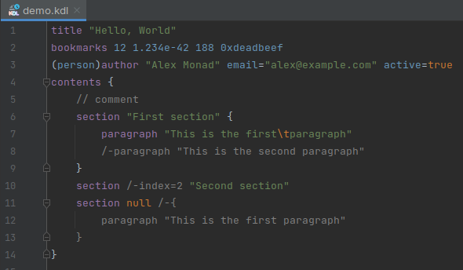

# Intellij KDL

## ToDo list
- [ ] [Publish a plugin manually](https://plugins.jetbrains.com/docs/intellij/publishing-plugin.html?from=IJPluginTemplate) for the first time.
- [ ] Set the Plugin ID in the above README badges.
- [ ] Set the [Deployment Token](https://plugins.jetbrains.com/docs/marketplace/plugin-upload.html).

<!-- Plugin description -->

IntelliJ Platform plugin with language support for [The KDL Document Language](https://kdl.dev/)

<!-- Plugin description end -->

## Installation

- Using IDE built-in plugin system:
  
  <kbd>Settings/Preferences</kbd> > <kbd>Plugins</kbd> > <kbd>Marketplace</kbd> > <kbd>Search for "intellij-kdl"</kbd> >
  <kbd>Install Plugin</kbd>
  
- Manually:

  Download the [latest release](https://github.com/Exidex/intellij-kdl/releases/latest) and install it manually using
  <kbd>Settings/Preferences</kbd> > <kbd>Plugins</kbd> > <kbd>⚙️</kbd> > <kbd>Install plugin from disk...</kbd>

